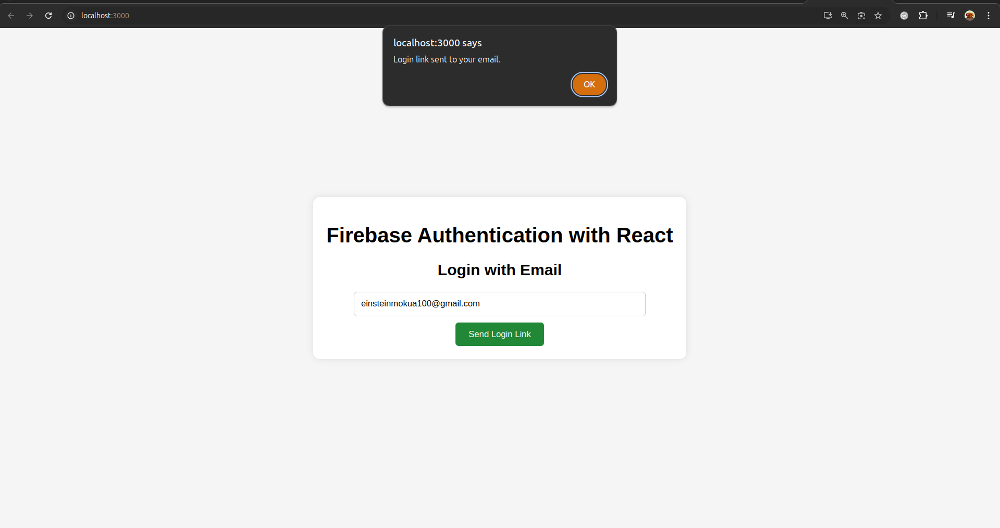

# Firebase Authentication with ReactJS - Beginner's Guide

Welcome to the Firebase Authentication with ReactJS Beginner's Guide! This project demonstrates how to integrate Firebase email link authentication into a React application. Follow this guide to set up Firebase authentication, send login links to users, and handle sign-in with email links.

## Table of Contents

1. [Introduction](#introduction)
2. [Prerequisites](#prerequisites)
3. [Setup Instructions](#setup-instructions)
4. [Project Structure](#project-structure)
5. [Code Explanation](#code-explanation)
6. [Testing the Application](#testing-the-application)
7. [Troubleshooting](#troubleshooting)
8. [Additional Resources](#additional-resources)

## Introduction

This project demonstrates how to use Firebase for email link authentication in a React application. Firebase Authentication provides an easy way to authenticate users with various methods, including email links. This guide will walk you through setting up Firebase authentication and integrating it with a React application.

## Prerequisites

Before you begin, ensure you have the following:

- Node.js and npm installed on your machine.
- A Firebase account. If you don't have one, [create a Firebase project](https://console.firebase.google.com/).

## Setup Instructions

### 1. Clone the Repository

Start by cloning this repository to your local machine:

```bash
git clone https://github.com/Nyandiekahh/Firebase-Authentication-with-ReactJS-Beginner-Guide..git
cd Firebase-Authentication-with-ReactJS-Beginner-Guide.
```

### 2. Install Dependencies

Navigate to the project directory and install the necessary dependencies:

```bash
npm install
```

### 3. Configure Firebase

Create a Firebase project in the Firebase Console and obtain your configuration credentials.

1. Go to the [Firebase Console](https://console.firebase.google.com/).
2. Click on "Add project" and follow the setup steps.
3. Once your project is created, go to "Project settings" and find your Firebase SDK configuration.

### 4. Set Up Environment Variables

Create a `.env` file in the root of your project and add your Firebase configuration details. The `.env` file should look like this:

```
REACT_APP_FIREBASE_API_KEY=your-api-key
REACT_APP_FIREBASE_AUTH_DOMAIN=your-auth-domain
REACT_APP_FIREBASE_PROJECT_ID=your-project-id
REACT_APP_FIREBASE_STORAGE_BUCKET=your-storage-bucket
REACT_APP_FIREBASE_MESSAGING_SENDER_ID=your-messaging-sender-id
REACT_APP_FIREBASE_APP_ID=your-app-id
```

### 5. Update Firebase Configuration

Make sure the `firebase.js` file contains the following code:

```javascript
import { initializeApp } from "firebase/app";
import { getAuth, isSignInWithEmailLink, signInWithEmailLink, sendSignInLinkToEmail } from "firebase/auth";

// Your Firebase configuration from environment variables
const firebaseConfig = {
  apiKey: process.env.REACT_APP_FIREBASE_API_KEY,
  authDomain: process.env.REACT_APP_FIREBASE_AUTH_DOMAIN,
  projectId: process.env.REACT_APP_FIREBASE_PROJECT_ID,
  storageBucket: process.env.REACT_APP_FIREBASE_STORAGE_BUCKET,
  messagingSenderId: process.env.REACT_APP_FIREBASE_MESSAGING_SENDER_ID,
  appId: process.env.REACT_APP_FIREBASE_APP_ID,
};

// Initialize Firebase
const app = initializeApp(firebaseConfig);
const auth = getAuth(app);

export { auth, isSignInWithEmailLink, signInWithEmailLink, sendSignInLinkToEmail };
```

## Project Structure

- `App.js`: The main component of the application that handles the authentication flow.
- `firebase.js`: Contains Firebase configuration and authentication functions.
- `Login.js`: A component that allows users to enter their email and request a sign-in link.

## Code Explanation

### `App.js`

This file sets up the authentication flow:

1. **useEffect Hook**: Checks if the URL contains an email sign-in link and attempts to sign in the user if it does.
2. **Alert**: Displays a message upon successful sign-in.

### `firebase.js`

This file initializes Firebase with your configuration and exports authentication functions:

- **`initializeApp`**: Initializes Firebase with your project's settings.
- **`getAuth`**: Retrieves the Firebase authentication instance.
- **`isSignInWithEmailLink`**: Checks if the current URL is an email link sign-in.
- **`signInWithEmailLink`**: Signs in the user with the email link.
- **`sendSignInLinkToEmail`**: Sends an email link for sign-in to the provided email address.

### `Login.js`

This component handles user input and sends a sign-in link to the user's email:

1. **State Management**: Manages the email input field.
2. **handleLogin Function**: Sends the sign-in link and stores the email in local storage.

## Testing the Application

1. **Run the Application**: Start the development server:

   ```bash
   npm start
   ```

2. **Open the Application**: Visit `http://localhost:3000` in your web browser.

3. **Test the Login Flow**: Enter an email address in the login form and check your email for the sign-in link. Click the link to sign in.

## Troubleshooting

- **Email Link Not Sent**: Ensure the email address is correctly formatted and check your Firebase configuration.
- **Sign-In Link Issues**: Verify the URL used for redirection in `actionCodeSettings` matches the domain in Firebase settings.

## Additional Resources

- [Firebase Authentication Documentation](https://firebase.google.com/docs/auth)
- [React Documentation](https://reactjs.org/docs/getting-started.html)
- [Handling Authentication in React](https://reactjs.org/docs/conditional-rendering.html#example)
